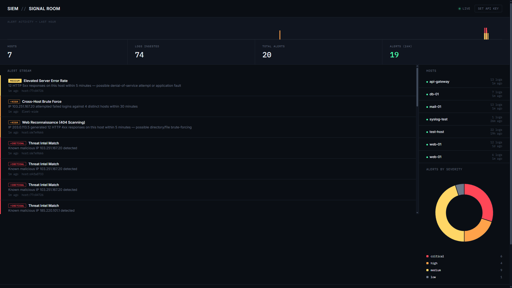
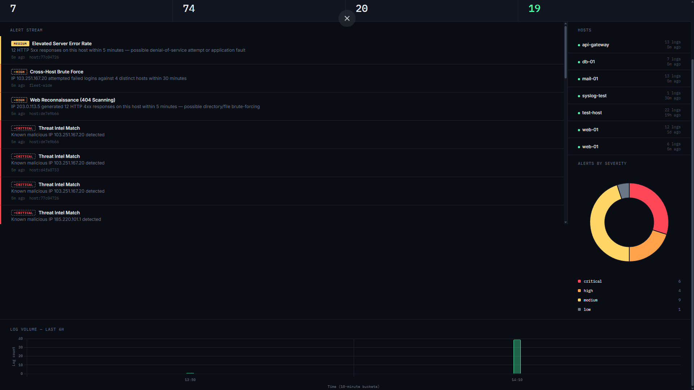

# SIEM — A Hands-On Security Information & Event Management Lab

[](https://github.com/nathanlopes45/siem/actions/workflows/ci.yml)

A custom-built SIEM backend that ingests logs, correlates events, and raises alerts on suspicious activity — built from scratch to understand how detection engineering actually works under the hood, rather than just operating someone else's tool.

## Why this project exists

Most SIEM experience on a resume comes from clicking around Splunk or Sentinel dashboards. This project goes one layer deeper: designing the log schema, writing the correlation logic, and reasoning about detection tradeoffs (false positives, alert fatigue, time-window sizing, ingestion vs. detection latency) myself.




## Architecture

```
                 ┌─────────────┐
   raw logs ───► │   FastAPI   │──── fast path: parse + store only
                 │  (ingest)   │
                 └──────┬──────┘
                        │
                        ▼
                ┌───────────────┐        ┌─────────────────────┐
                │   PostgreSQL  │◄──────►│  Detection Worker   │
                │ hosts/logs/   │  polls │  (separate process, │
                │   alerts      │  every │   runs on a timer)  │
                └───────┬───────┘   10s  └─────────────────────┘
                        │
                        │ on-demand triage request
                        ▼
                ┌───────────────┐
                │  Ollama (LLM) │  local, free, no API key —
                │  llama3.2:1b  │  alert data never leaves
                └───────────────┘  the machine
```

- **API layer**: FastAPI. Ingestion is deliberately "dumb and fast" — parse structured fields from the raw log, store it, return. No detection logic runs on the request path.
- **Detection worker**: a separate process/container that polls the database on a fixed interval and runs every detection rule against each host, plus one fleet-wide cross-host correlation check per cycle. Decoupled so a slow or failing detector can never add latency to log ingestion.
- **LLM triage**: a locally-run open-source model (via [Ollama](https://ollama.com)) generates a plain-English summary, severity rating, and recommended action for an alert on demand — free, no external API, and no security log data ever leaves the machine. Purely advisory; nothing in the pipeline acts automatically on the model's output.
- **Log parsing**: structured field extraction (event type, username, source IP, source port) at ingest time, rather than one generic regex grabbing an IP out of an opaque string.
- **Alerting**: genuinely new alerts (not duplicates) fire a Slack/webhook notification.
- **Storage**: PostgreSQL via SQLAlchemy ORM, with indexes on the columns every detector actually filters/groups by.
- **Testing**: a pytest suite runs the real detection logic against a real (throwaway) Postgres database, including a regression test for a bug found and fixed during development.
- **Deployment**: fully containerized with Docker Compose — API, worker, Postgres, and Ollama as independent services sharing one database.

## Detections implemented

| Detection | Logic | MITRE ATT&CK |
|---|---|---|
| Brute Force Attempt | ≥5 `failed_password` events from one IP against a host | [T1110 – Brute Force](https://attack.mitre.org/techniques/T1110/) |
| Rapid Brute Force | ≥5 `failed_password` events from one IP within a 2-minute window | T1110 (time-boxed variant) |
| Successful Brute Force | An `accepted_password` event from an IP that had ≥5 prior `failed_password` events | T1110 → T1078 (Valid Accounts, post-compromise) |
| Threat Intel Match | Log's source IP matches a known-malicious IP list | [T1071 – Application Layer Protocol](https://attack.mitre.org/techniques/T1071/) (C2 infrastructure reuse) |
| Cross-Host Brute Force | One source IP with failed logins against ≥3 distinct hosts within 30 minutes | [T1110 – Brute Force](https://attack.mitre.org/techniques/T1110/) (fleet-wide targeting — reconnaissance / credential stuffing signal, not scoped to a single host) |
| Web Reconnaissance (404 Scanning) | One IP generating ≥10 HTTP 4xx responses against a host within 5 minutes | [T1595.003 – Active Scanning: Wordlist Scanning](https://attack.mitre.org/techniques/T1595/003/) (directory/file brute-forcing, e.g. gobuster/dirbuster) |
| Elevated Server Error Rate | ≥10 HTTP 5xx responses on a host within 5 minutes | No single MITRE mapping — flagged as an anomaly worth investigating (possible DoS attempt, or an application fault), not asserted as malicious |

All detections run against structured, parsed fields (`event_type`, `attacker_ip`) rather than raw-text pattern matching, and use aggregated `GROUP BY`/`HAVING` queries rather than pulling every row into Python.

## Tech stack

- **Backend**: Python, FastAPI, SQLAlchemy
- **Database**: PostgreSQL
- **AI**: Ollama running `llama3.2:1b` locally for LLM-assisted alert triage — no external API, no cost, log data stays on-machine
- **Containerization**: Docker, Docker Compose (API, worker, Postgres, and Ollama as independent services)
- **Security**: API key authentication (constant-time comparison, fail-closed), gitignored secrets, `detect-secrets` scanning
- **Detection engineering**: custom correlation rules (single-host and cross-host), structured log parsing, aggregated SQL queries, decoupled background detection worker
- **Testing**: pytest suite exercising real detection logic against a real database

## Getting started

### Prerequisites
- Docker and Docker Compose installed

### Setup

```bash
git clone https://github.com/nathanlopes45/siem.git
cd siem
cp .env.example .env
# edit .env: set a real POSTGRES_PASSWORD and a long random API_KEY
# optional: set ALERT_WEBHOOK_URL to a Slack Incoming Webhook URL to get
# notified when new alerts fire. Leave blank to disable notifications.
docker compose up --build -d

# one-time: pull the local LLM used for alert triage (free, runs locally
# via Ollama — no API key, no per-request cost, and log data never leaves
# your machine). ~1.3GB download, only needed once.
docker exec -it siem_ollama ollama pull llama3.2:1b
```

This starts four containers: `siem_postgres`, `siem_api`, `siem_worker`, and `siem_ollama` (local LLM for alert triage). The API is available at `http://localhost:8000`. The worker runs silently in the background, polling every 10 seconds.

Every endpoint except the root health check (`GET /`) requires an `X-API-Key` header matching the `API_KEY` value in your `.env`.

### Verify it's running

```bash
curl http://localhost:8000/
# {"status":"SIEM backend running with database connected"}
```

## API usage

All requests below require your API key. Export it once per terminal session so you don't have to repeat it:
```bash
API_KEY="your-api-key-from-.env"
```

### Register a host
```bash
curl -X POST "http://localhost:8000/hosts?hostname=web-server-01&ip_address=10.0.0.5&os_type=linux" \
  -H "X-API-Key: $API_KEY"
```

### Ingest a log
```bash
curl -X POST "http://localhost:8000/logs" \
  -H "X-API-Key: $API_KEY" \
  -H "Content-Type: application/json" \
  -d '{"host_id": "<HOST_UUID>", "log_source": "sshd", "raw_log": "Failed password for root from 185.220.101.1 port 4444 ssh2"}'
```

The response includes structured fields extracted by the parser: `event_type`, `username`, `attacker_ip`, `src_port`.

### Supported log sources

| `log_source` value | Format | Structured fields extracted |
|---|---|---|
| `sshd`, `ssh`, `auth` | OpenSSH auth.log | `event_type` (failed_password / accepted_password / invalid_user), `username`, `attacker_ip`, `src_port` |
| `nginx`, `apache`, `web`, `access` | Combined Log Format | `event_type` (http_2xx/3xx/4xx/5xx), `attacker_ip`, `http_status`, `http_path`, `http_method` |

Example web log ingest:
```bash
curl -X POST "http://localhost:8000/logs" \
  -H "X-API-Key: $API_KEY" \
  -H "Content-Type: application/json" \
  -d '{"host_id": "<HOST_UUID>", "log_source": "nginx", "raw_log": "203.0.113.5 - - [10/Jul/2026:14:32:10 +0000] \"GET /wp-admin/ HTTP/1.1\" 404 512 \"-\" \"Mozilla/5.0\""}'
```

Unrecognized `log_source` values fall back to a generic parser that still extracts an IP if present, so ingestion never fails outright on an unfamiliar format — it just won't get full structured extraction.

### Real syslog ingestion (UDP)

Beyond the HTTP API, the SIEM also runs a real syslog listener on UDP port 514 (`app/syslog_listener.py`, its own container) — so logs can be pushed the way a real syslog daemon forwards them (`rsyslog`'s `@@host:514`, the standard `logger` command, etc.), not only sent as hand-crafted JSON via curl.

**How it attributes messages to a host**: by exact match of the UDP packet's source IP against a registered `Host.ip_address`. This is a deliberate simplification appropriate for a lab setup with a small number of known hosts — a production-grade receiver would need more robust source identification (TLS client certs, structured syslog headers with an explicit hostname field). Messages from unregistered source IPs are logged and dropped rather than silently misattributed.

To test it, register a host with a real, reachable IP, then send it a message from that address:
```bash
curl -X POST "http://localhost:8000/hosts?hostname=syslog-test&ip_address=<YOUR_TEST_IP>&os_type=linux" -H "X-API-Key: $API_KEY"

# from a machine at <YOUR_TEST_IP>:
logger -n <SIEM_HOST> -P 514 -d "Failed password for root from 45.95.147.120 port 4444 ssh2"
```
Then confirm it landed:
```bash
curl "http://localhost:8000/logs?log_source=sshd" -H "X-API-Key: $API_KEY"
```

### List hosts
```bash
curl http://localhost:8000/hosts -H "X-API-Key: $API_KEY"
```

### Query logs (optionally filter by host, source, or event type)
```bash
curl "http://localhost:8000/logs?host_id=<HOST_UUID>&event_type=failed_password" \
  -H "X-API-Key: $API_KEY"
```

### View triggered alerts
```bash
curl http://localhost:8000/alerts -H "X-API-Key: $API_KEY"
```

### Manually trigger detection for a host (useful for demos — the worker also does this automatically every 10s)
```bash
curl -X POST "http://localhost:8000/detect/<HOST_UUID>" -H "X-API-Key: $API_KEY"
```

### Manually trigger the fleet-wide cross-host correlation check
```bash
curl -X POST "http://localhost:8000/detect-cross-host" -H "X-API-Key: $API_KEY"
```

### Get an LLM-generated triage summary for an alert
```bash
curl -X POST "http://localhost:8000/alerts/<ALERT_UUID>/triage" -H "X-API-Key: $API_KEY"
```
Returns a plain-English summary, a severity rating, and a recommended next step, generated by a locally-run open-source model (via [Ollama](https://ollama.com), default `llama3.2:1b`) from the alert plus its related raw log lines. Free, no API key, and the log data never leaves your machine — purely advisory, nothing in this pipeline takes automated action based on the model's output.

### Run a full agentic investigation
```bash
curl -X POST "http://localhost:8000/alerts/<ALERT_UUID>/investigate" -H "X-API-Key: $API_KEY"
```
Multi-step ReAct agent — see [Agentic Investigation](#agentic-investigation) above. Slower than `/triage` (typically several model calls instead of one), but produces a fuller, tool-informed conclusion with a persisted, auditable reasoning trace.

```bash
curl "http://localhost:8000/alerts/<ALERT_UUID>/investigations" -H "X-API-Key: $API_KEY"
```
Returns past investigations for an alert, including the full step-by-step trace.

## Agentic Investigation

Alongside single-shot LLM triage (`POST /alerts/{id}/triage`), the SIEM supports a full **agentic investigation** (`POST /alerts/{id}/investigate`) — a hand-rolled [ReAct](https://arxiv.org/abs/2210.03629) (Reasoning + Acting) loop, not just one prompt and one answer.

**How it differs from triage**: given an alert, the model decides what additional context it actually needs, calls a tool to fetch it, observes the result, and decides again — repeating until it concludes or hits a hard iteration cap (5). Triage gives the model a fixed 20-log window up front; the agent decides for itself what's relevant to look up.

**Tools available to the agent** (all strictly read-only — the agent can investigate, but can never take action):
- `get_recent_logs(host_id, event_type, limit)`
- `check_threat_intel(ip)`
- `check_cross_host_activity(ip)`
- `get_host_info(host_id)`

**Design principles**:
- **Read-only tools only.** An investigating agent should never be able to block an IP, kill a process, or modify data on its own — that boundary is enforced by simply not exposing any such tool, not by prompting the model to "be careful."
- **Bounded iterations.** A hard cap prevents any possibility of a runaway loop.
- **Full auditability.** Every thought, tool call, and observation is persisted (`AgentInvestigation` table, `GET /alerts/{id}/investigations`) — not just the final answer. The dashboard's "View agent reasoning trace" panel shows the entire chain, so the agent's conclusion is never a black box.
- **Graceful fallback.** If the model can't produce a valid, parseable Final Answer within the iteration cap (small local models aren't always reliable at strict output formats), the system falls back to the simpler single-shot triage rather than failing outright.

Same local, free Ollama backend as triage — configurable independently via `OLLAMA_AGENT_MODEL` if a larger local model proves more reliable at following the agent's output format than the default.

## Alerting

New alerts (not duplicates — only genuinely new findings) trigger a webhook POST if `ALERT_WEBHOOK_URL` is set in `.env`. This works out of the box with [Slack Incoming Webhooks](https://api.slack.com/messaging/webhooks): create one in your workspace, paste the URL into `.env`, and new alerts will post directly to a Slack channel. If the webhook isn't configured, or the request fails, notification is skipped silently — this can never block or break the detection engine itself.

## Engineering Decisions

A few deliberate tradeoffs worth calling out explicitly, since they came up while building this rather than being obvious upfront:

- **Polling worker over a message queue (Celery/Redis).** Detection runs on a fixed 10-second poll instead of being event-driven. For this project's scale, a queue would add real infrastructure complexity (a broker, task serialization, worker pool management) for a latency improvement that doesn't matter here — logs aren't time-critical to the second. If detection needed to react in real time at production log volume, that tradeoff would flip.
- **Local LLM (Ollama) over a hosted API.** Free and no per-request cost, but the more important reason for a security tool specifically: alert and log content never leaves the machine. Sending security telemetry to a third-party API is itself something worth scrutinizing in a real SOC context.
- **Two different local models for two different tasks.** Single-shot triage uses `llama3.2:1b` (fast, the task is simple JSON classification). The agentic investigation loop uses `llama3.2:3b` — multi-step tool-calling reasoning is a harder task, and the smaller model was measurably less reliable at it (see the hand-rolled parser robustness below, which exists specifically because of this).
- **Hand-rolled ReAct loop over a framework (LangChain, etc.).** More code to write, but it means every failure mode is one I actually debugged and fixed myself — including a real bug where a model could fabricate an entire fake tool-call transcript in one response and conclude on data it never actually retrieved. That bug, and the fix (only honoring whichever comes first, a genuine `Action` or a genuine `Final Answer`, discarding fabricated continuations), wouldn't have been visible or fixable the same way behind a framework abstraction.
- **API key auth over full user accounts/JWT.** Right-sized for a single-operator lab. Constant-time comparison and fail-closed behavior are still real, correctly-implemented security properties, not just "any string works."
- **Syslog host attribution by source IP, not by authenticated identity.** A known, documented simplification (see "Real syslog ingestion" above) — the honest tradeoff of building a real UDP listener without also building a full mutual-TLS syslog transport for a lab project.

## Deploying it somewhere reachable

Running this only on `localhost` means anyone evaluating it has to trust your README rather than clicking a link. A cheap VPS (DigitalOcean, Linode, a free-tier AWS/Oracle instance — $0-6/month) is enough, since this is already fully containerized.

**Runbook:**

1. **Provision a small VPS** (1-2 vCPU, 2-4GB RAM — the Ollama models need some headroom). Install Docker and Docker Compose on it.
2. **Clone the repo, set up `.env`** exactly as in local setup, with a strong `API_KEY` and `POSTGRES_PASSWORD` (not the ones you used locally).
3. **Lock down the firewall before exposing anything.** Only the reverse proxy port (443/80) should be reachable from the internet:
   ```bash
   ufw default deny incoming
   ufw allow 22/tcp    # SSH
   ufw allow 80/tcp
   ufw allow 443/tcp
   ufw enable
   ```
   Critically: **do not** expose `5432` (Postgres), `11434` (Ollama), or `514` (syslog) to the public internet. In `docker-compose.yml`, change those services' `ports:` mappings to bind only to localhost, e.g. `"127.0.0.1:5432:5432"`, or remove the host-port mapping entirely for services that don't need external access (`db` and `ollama` never need to be reachable from outside the Docker network at all — only `api` does, and `syslog` only if you're actually forwarding logs from an external box).
4. **Put a reverse proxy in front with real TLS.** [Caddy](https://caddyfile.dev/) is the simplest option — it gets you free, auto-renewing HTTPS certs with about 4 lines of config:
   ```
   yourdomain.com {
       reverse_proxy localhost:8000
   }
   ```
   Running the dashboard over plain HTTP on a public IP means your API key travels in cleartext — worth avoiding even for a demo.
5. **Point a domain (or subdomain) at it**, or just share the raw IP if you don't have one handy.
6. **Regenerate all secrets** for the deployed instance rather than reusing local dev values — treat this the same as you would any other environment promotion.

This is left as a runbook rather than something already done for you, since it requires access to a cloud account and DNS you control — but once done, it's a genuinely strong addition: a live, clickable link plus "hardened the deployment (firewall rules, no exposed DB/internal ports, TLS via Caddy)" is a concrete, specific thing to say in an interview.

## Security practices in this repo

- No secrets committed — credentials are loaded from a gitignored `.env`, with `.env.example` as the template
- `detect-secrets` baseline scan integrated to catch accidental credential leaks before they're pushed
- Database connection retry/healthcheck logic to avoid race conditions on container startup

## Running the tests

Tests exercise the real detection logic against a real (throwaway) Postgres database — not mocks — since the whole point of these detectors is correct SQL aggregation behavior.

The test database (`siem_test_db`) is created automatically alongside the main database via a Postgres init script (`db-init/01-create-test-db.sql`) — no manual setup needed on a fresh `docker compose up`. This only runs on a brand-new volume, so if you already have an existing `postgres_data` volume from before this was added, create it once manually:
```bash
docker compose exec db createdb -U ${POSTGRES_USER:-siem_user} siem_test_db
```

Run the full suite:
```bash
docker compose exec api pytest -v
```

Each test creates its own schema, runs, then drops it — tests don't interfere with each other or with your dev data in `siem_db`.

## Dashboard

A live signal dashboard at `http://localhost:8000/dashboard` — alert stream with click-to-expand AI triage, a live pulse strip synced to the worker's 10-second poll cycle, per-host activity, a severity-colored doughnut chart of alerts by type, and a log volume chart. On first load it asks for your API key (stored only in your browser's local storage, sent only to this API) — no separate login system needed.

## Roadmap

- [x] Real log parsing (structured `event_type`/`username`/`src_port` fields instead of a single regex-extracted IP)
- [x] Decoupled background detection worker (moved off the ingestion request path)
- [x] API authentication (API key required on every endpoint except health check)
- [x] Cross-host correlation (same attacker IP hitting multiple hosts — lateral movement / credential stuffing signal)
- [x] Alerting integrations (Slack/webhook notifications on new alerts)
- [x] LLM-assisted alert triage: natural-language incident summaries and severity suggestions generated from raw log context
- [x] Agentic multi-step investigation (ReAct loop with read-only tools: log lookup, threat intel, cross-host activity, host info) with a persisted, auditable reasoning trace
- [x] Automated test suite for detection logic
- [x] Dashboard for visualizing alerts and log volume over time
- [x] Support additional log source formats beyond SSH (web server access logs — Combined Log Format, with 404-scanning and error-spike detectors)
- [x] Real syslog (UDP) ingestion, not only HTTP JSON
- [x] CI pipeline (GitHub Actions): automated test suite + secret scanning on every push
- [ ] Deployed to a publicly reachable environment (runbook provided in README, execution pending — requires a cloud account/domain)

## License

MIT